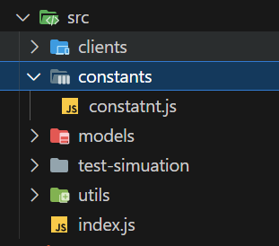
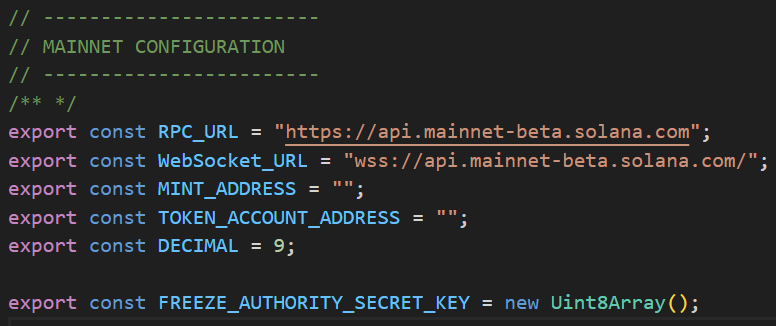
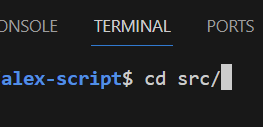
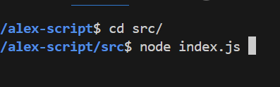

## Introduction

This Node.js script is designed to automatically track non-whitelisted addresses. Upon identification, it freezes their wallets and records the wallet address, amount, and transaction signature in an Excel sheet. This automation aids in efficiently managing and auditing transactions within the system.

## Prerequisites

Before you begin, ensure you have the following:

- An active internet connection.
- Node.js installed on your system (LTS version recommended). Node.js can be downloaded from [https://nodejs.org/](https://nodejs.org/).

## Installation

To set up the script on your local/remote machine, follow these steps:

1. **Clone the Repository (if applicable)**:
   If the script is hosted in a git repository, clone it to your local machine using the following command in your terminal:

   ```bash
   git clone https://github.com/127001sudais/alex-script.git
   cd alex-script
   ```

2. **Install Dependencies**:
   Navigate to the root directory of the script and run the following command to install the necessary dependencies:
   ```bash
   npm install
   ```

## Configuration

To configure the script to work within your environment, you'll need to set up some essential details:

- Navigate to `src/constants/constatnt.js`.
- 
- Open the file and fill in the correct details as per your requirements.
- 

## Running the Script

Follow these steps to run the script:

1. Open your terminal.
   ```bash
   ctrl + `
   ```
2. Access the script's source directory:
   ```bash
   cd src/
   ```
   
3. Start the script by running:
   ```bash
   node index.js
   ```
   

This initiates the process of tracking, freezing non-whitelisted wallets, and recording the details in an Excel sheet.

## Troubleshooting

If you encounter any issues while setting up or running the script, ensure:

- You have an active internet connection.
- Node.js is correctly installed and updated to the LTS version.
- All the required details in `src/constants/constatnt.js` are correctly filled out.

## Contact Information

For questions please contact me at `deokumarithapa0023@gmail.com`

## Common Questions

Q: Can I run this script on any operating system?

A: The script is platform-independent but requires Node.js. It should work on any OS where Node.js can be installed.
